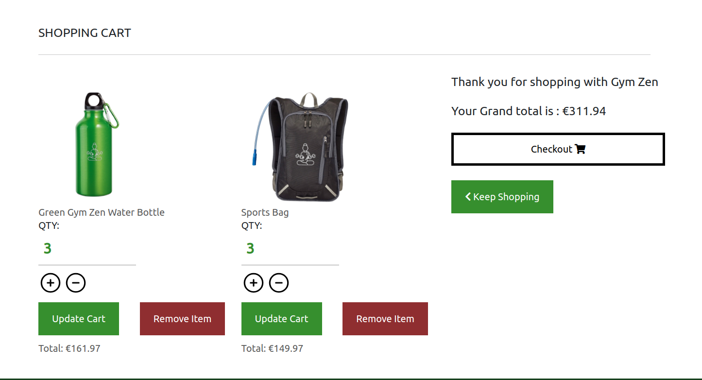

# GYM ZEN


Gym Zen aims to be a friendly, affordable and professional gym where you train both your body and your mind.

[Link to Gym Zen](https://gym-zen-28414054e650.herokuapp.com/)

## **Contents**

1. [U/X](#ux)
    - [The Strategy Plane](#strategy-plane)
        - [Agile Planning](#agile-planning)  
        - [Epics and tasks](#epics-and-tasks)
    - [The Skeleton Plane](#skeleton-plane) 
        - [Wireframes](#wireframes)
    - [The Scope Plane](#scope-plane) 
    - [The Structure Plane](#structure-plane)  
      - [Features](#features)  
   - [The Surface Plane](#surface-plane) 
      - [Design](#design)   
        - [Colour pallette](#colour-pallette)
        - [Typography](#typography)
4. [Technologies Used](#technologies-used)  
    - [Languages and frameworks used](#languages-and-frameworks-used)
    - [Libraries and Django Plugins Used](#libraries-and-django-plugins-used)
    - [Tools Used](#tools-used)
    - [Linters used](#linters-used)
6. [Deployment](#deployment)    
    - [ElephantSQL DataBase](#elephantsql-database)
    - [Cloudinary API](#cloudinary-api)
    - [Heroku Deployment](#heroku-deployment)
    - [Local Deployment](#local-deployment)
5. [Testing](#testing)
7. [Credits](#credits)
8. [Acknowledgements](#acknowledgements)  

# UX

# Strategy Plane

## Agile Planning

This project has been approached with an Agile mindset. As this is the biggest project I have attempted in both size and scope, the compartmentalization and digestible  nature of agile was extremely helpful this time around.


This can be seen implemented on my projects [Kanban.](https://github.com/users/EeeBeeDee/projects/4/views/1)

## Epics and Tasks

Due to the nature of Django it is easy to base the majority of your epics off each app you plan to develop, the only one outside this paradigm is the first, which is used to set up the hosting environment, connect the database and generally initialize the project.

### **Epic 1: Project Initialization & Deployment**

This includes the initial project setup, installing the framework, dependencies and libraries. Setting up ElephantSQL. Configuring our settings.py file and Heroku Application so that everything is connected and running on the live site as early as possible.

---

### **Epic 2: Homepage & memberships**

I had planned from the start to try really make the homepage pop. I feel on some of my other projects I had over designed throughout but at the same time I do love trying to make interesting styles work. So the plan was to make the rest of the site less busy. Hit viewers with a burst of information first and then tone it down. As I had put a good bit of effort into the homepage I was happy to place 2 of my custom models within it too to give it a modular feeling.


---

### **Epic 3: Products app**

The core model to the sites functionality, I wanted to make movement between each one as seamless as possible, using featured and recommended widgets was planned from the start and I think it works well through out the products App.  

---

### **Epic 4: Bag App**

The main focus here was to get both local storage and custom context processors working consistently without any issue as handled incorrectly they can both cause havoc to a website. I wanted to make the bag page feel almost like it was still part of the products page. I went with big containers for each item in the bag and a layout similar to the product detail for each.

---

### **Epic 5: Checkout & Stripe** 

Outside of creating properly working functionality to actually pass this assessment my main goal here was to make sure I really understood how Django, the stripe API and the client side browser were really interacting as it was the most difficult part of the course for me to understand. So I purposefully tried to do things slightly differently and see if what I thought was correct was actually the case  

---

### **Epic 6: Documentation and Testing**

Create both my TESTING.md and this README.md to document the creation and implementation to this project.

---

## **Unresolved Epics**

### **Epic 7: User Accounts**

I wanted to created user profile models or extend the built in user model to allow for different levels of memberships. Some that would give a blanket discount on all goods or give access to all "Locations" of the gym, that is one thing I will be implementing after this course is finished. 

---

# Skeleton Plane

## Figma

I used figma to plan out my homepage as in my head it was a lot more involved stylistically than any of the other pages. Having it prototyped out like this made it very smooth to develop and it is the way I will tackle things going forward. Even though you can see changes I am very happy that the original plan was followed so closely.


## Facebook mockup 

I made a Facebook page mock up. Something that would be required for most website being developed for a business.


## Wireframes

The rest of the original mock up were done using Balsamiq. These pages were the Products and product detail page respectively


# Scope Plane

- Landing page which conveys what the website is used for.
- Allow a user to purchase multiple items and pay online seamlessly.
- Make sure the website is functional and presentable in all formats and screen sizes.

# Structure Plane 

## Features

### Hero/Landing


The plan with the Hero was to grab attention with the video, but not have a huge amount going on in said video, so eyes would still wander around the screen.

### Navbar


I wanted a minimal design with the navbar at first glance, thats why I opted for a menu burger button at all sizes. On scroll the background of the nav eventually turns to black. This happens once the user scrolls past the hero

### Menu


I wanted to go with a bombastic menu and incorporated my own take on some mouse movement animations I had learned a few months ago from [Hyperplexed](https://www.youtube.com/@Hyperplexed) on youtube

For mobile I removed all movement animations and just went with the full screen stark black background, the bottom option as seen in the mobile picture only appears for admin users

### Quotes


Just below the hero I wanted what in my opinion is the best section of work I did on this. On top of the styling I was very happy with, it incorporates two animations with JS I made from scratch and a custom model used to display a random quote every time the page is refreshed 

### Slides


I wanted to implement in a model to this carousel I built from scratch as I ended up being every happy with it. The JS is also future proofed and scalable as this should work perfectly with any amount of pictures

### Classes


With my Third custom model it seemed to make sense that someone running a gym website would like to be able to update class offerings cleanly and efficiently

### Products Page


I really tried to design with the green gradient in mind for this page. I also wanted to try use the url calls in interesting way, like having a button add one of the item to your bag and bring you straight to checkout.

### Product Detail Page


In the first picture is the normal view for a general viewer. I tried to keep it clean and flat and quickly understood as this is the screen where the decision to spend money is made.

The second picture is an admins view of the page with an edit and delete button. I wanted to make the admins front end use for updating products as similar to the general publics use of the site

### Bag



I aimed to have the bag view as close to the product detail view as I could to make it feel as you could still shop on this screen and not just check what is here. Options to update the quantity and delete each bag item are found here. Along with your grand total and access to checkout.

### Checkout


The checkout is less busy than the bag with just more straight info. You are given a breakdown of each bag items price plus a grand total. The form is used to then give you your order confirmation once payment is confirmed by the stripe API.

### Checkout Success


The checkout success screen is only seen after a conformation of payment on stripes end. It then displays all relevant information to your purchase along with an email of the same sent to you.

### Add/Edit product


The checkout success screen is only seen after a conformation of payment on stripes end. It then displays all relevant information to your purchase along with an email of the same sent to you.

# Surface Plane

## Design 

### Colour pallette 


For this project I knew I wanted to work with gradients. In most things I have built up to this point I feel I have been using too many colours too liberally. This along with the basic premise of a gym in my head I choose green as it embodies energy and life. I feel leaning into the gradient helped me come up with some of my best design features to date.

### Logo


The logo was generated using dall-e. I had a clear image in my head and in fairness within 5 iterations its was pretty much bang on. I would have spend hours in photoshop if I hadn't decided to give it a try.

### Typography 

For typography I decided to go for a singular font again, feeling I didn't do it justice in my last project. I chose Ubuntu as its a font I look at almost every day and have really grown to like. I feel it quite versatile too and with just a change in font weights you can create different feelings. More so than any other font I have used up to this point. 

It can be found on [Google Fonts](https://fonts.google.com) here [Ubuntu](https://fonts.google.com/specimen/Ubuntu). After trying a few out I felt it meshes well with the soft, rounded feel I have aimed for with the design. 

## Business model for Gym Zen

### Application types 

As a public gym that sells mechandise. The application types that apply in this business case are:

-B2C
-Products
-Services
-Single Payment
-recurring payment

### Features 

With the application types in mind I feel the best features to aim for are as follows:

- Simple, elegant payment system 
- Cart or bag system to make shopping easier
- High resolution images of items for sale
- The ability to filter products to create a quicker shopping experience  
- Clear communication of what services are provided with a membership 

## Search Engine Optimization (SEO) & Social Media Marketing

### Keywords

I've identified some appropriate keywords to align with my site, that should help users
when searching online to find my page easily from a search engine.
This included a series of the following keyword types

- Short-tail (head terms) keywords
- Long-tail keywords

### Sitemap

I've used [XML-Sitemaps](https://www.xml-sitemaps.com) to generate a sitemap.xml file.
This was generated using my deployed site URL: https://gym-zen-28414054e650.herokuapp.com

After it finished crawling the entire site, it created a
[sitemap.xml](sitemap.xml) which I've downloaded and included in the repository.

### Robots

I've created the [robots.txt](robots.txt) file at the root-level.
Inside, I've included the default settings:

```
User-agent: *
Disallow: /accounts/
Disallow: /products/add/
Disallow: /products/edit/
Sitemap: https://gym-zen-28414054e650.herokuapp.com/sitemap.xml
```
I have disallowed pages that would required admin access.


## User Stories

### New Site Users

- As a new site user, I would like to be able to navigate the website quickly and easily.
- As a new site user, I would like to be able to view the website on any device.
- As a new site user, I want the websites main goals and selling points clear and easily seen.
- As a new site user, I would like to filter what I am looking for so I can find it easier.
- As a new site user, I would like to save items in a cart so I can pay all at once.
- As a new site user, I would like to feel there is offers or services geared to new customers.

### Returning Site Users

- As a returning site user, I would like to see any updates or new information on the website .
- As a returning site user, I would like to see that the website is updated.
- As a returning site user, I would like to feel there will be reasons for me to keep returning.

### Site Admin

- As a site administrator, I should be able to make changes to the site while I view it.
- As a site administrator, I should be able to update the store front quickly.
- As a site administrator, I should be able to edit existing offerings and fix any mistakes made.

# Technologies Used

## Languages and Frameworks Used

-   [HTML5](https://en.wikipedia.org/wiki/HTML5)
-   [CSS3](https://en.wikipedia.org/wiki/Cascading_Style_Sheets)
-   [Javascript](https://en.wikipedia.org/wiki/JavaScript)
-   [Python3](https://www.python.org/)
-   [Django](https://www.djangoproject.com/)
-   [Sass](https://sass-lang.com/)

## Libraries and Django Plugins Used

- [Font Awesome:](https://fontawesome.com/)
    - Font Awesome was used for the chevron arrows used for navigation through the site
- [Bootstrap:](https://getbootstrap.com/)
    - Bootstrap was used manly for formatting, positioning and responsive design throughout the project.
- [Django-Allauth:](https://django-allauth.readthedocs.io/en/latest/index.html)
    - Used to control user profile functionality.
- [whitenoise:](https://whitenoise.readthedocs.io/en/latest/)
    - Used to serve the static files like css etc to the live heroku site.

## Tools Used

- [VScode](https://code.visualstudio.com/)
    - Vscode was my code editor for this project.
- [Git](https://git-scm.com/)
    - Git was used for version control and to Push to GitHub.
- [GitHub:](https://github.com/)
    - GitHub is used to store the project's code remotely and then to host the static website on GitHub Pages.
- [Heroku:](https://signup.heroku.com/login)
    - Heroku is where the app is hosted and deployed online.
- [ElephantSQL:](https://www.elephantsql.com/)
    - ElephantSQL is where the database is hosted using postgreSQL
- [Cloudinary:](https://cloudinary.com/)
    - Cloudinary is connected to the project but not fully utilized due to time constraints, future plans are to have it host pictures restaurants can use for their own generated 
- [Figma](https://www.figma.com/)
    - Figma was used to create the mockup of of the homepage
- [DALL-E;](https://openai.com/research/dall-e)
    - Dall-e was used in the generation of the gym zen logo

## Linters used 

-   [W3C - HTML](https://validator.w3.org/)
-   [Jigsaw - CSS](https://jigsaw.w3.org/css-validator/)
-   [JSHint - JS](https://jshint.com/)
-   [PEP8CI - Python](https://pep8ci.herokuapp.com/)

## Testing

You can find all validation information in the [TESTING.md](/TESTING.md) file.

# Deployment

The live deployed application can be found deployed on [Heroku](https://gym-zen-28414054e650.herokuapp.com).

### ElephantSQL Database

This project uses [ElephantSQL](https://www.elephantsql.com) for the PostgreSQL Database.

To obtain your own Postgres Database, sign-up with your GitHub account, then follow these steps:

- Click **Create New Instance** to start a new database.
- Provide a name (this is commonly the name of the project: gym_zen).
- Select the **Tiny Turtle (Free)** plan.
- You can leave the **Tags** blank.
- Select the **Region** and **Data Center** closest to you.
- Once created, click on the new database name, where you can view the database URL and Password.

## Cloudinary API

This project uses the [Cloudinary API](https://cloudinary.com) to store media assets online, due to the fact that Heroku doesn't persist this type of data.

To obtain your own Cloudinary API key, create an account and log in.
- For *Primary interest*, you can choose *Programmable Media for image and video API*.
- Optional: *edit your assigned cloud name to something more memorable*.
- On your Cloudinary Dashboard, you can copy your **API Environment Variable**.
- Be sure to remove the `CLOUDINARY_URL=` as part of the API **value**; this is the **key**.

### Stripe API

This project uses [Stripe](https://stripe.com) to handle the ecommerce payments.

Once you've created a Stripe account and logged-in, follow these series of steps to get your project connected.

- From your Stripe dashboard, click to expand the "Get your test API keys".
- You'll have two keys here:
	- `STRIPE_PUBLIC_KEY` = Publishable Key (starts with **pk**)
	- `STRIPE_SECRET_KEY` = Secret Key (starts with **sk**)

### Gmail API

This project uses [Gmail](https://mail.google.com) to handle sending emails to users for account verification and purchase order confirmations.

Once you've created a Gmail (Google) account and logged-in, follow these series of steps to get your project connected.

- Click on the **Account Settings** (cog icon) in the top-right corner of Gmail.
- Click on the **Accounts and Import** tab.
- Within the section called "Change account settings", click on the link for **Other Google Account settings**.
- From this new page, select **Security** on the left.
- Select **2-Step Verification** to turn it on. (verify your password and account)
- Once verified, select **Turn On** for 2FA.
- Navigate back to the **Security** page, and you'll see a new option called **App passwords**.
- This might prompt you once again to confirm your password and account.
- Select **Mail** for the app type.
- Select **Other (Custom name)** for the device type.
	- Any custom name, such as "Django" or gym_zen
- You'll be provided with a 16-character password (API key).
	- Save this somewhere locally, as you cannot access this key again later!
	- `EMAIL_HOST_PASS` = user's 16-character API key
	- `EMAIL_HOST_USER` = user's own personal Gmail email address

### Heroku Deployment

This project uses [Heroku](https://www.heroku.com), a platform as a service (PaaS) that enables developers to build, run, and operate applications entirely in the cloud.

Deployment steps are as follows, after account setup:

- Select **New** in the top-right corner of your Heroku Dashboard, and select **Create new app** from the dropdown menu.
- Your app name must be unique, and then choose a region closest to you (EU or USA), and finally, select **Create App**.
- From the new app **Settings**, click **Reveal Config Vars**, and set your environment variables.

| Key | Value |
| --- | --- |
| `CLOUDINARY_URL` | user's own value |
| `DATABASE_URL` | user's own value |
| `DISABLE_COLLECTSTATIC` | 1 (*this is temporary, and can be removed for the final deployment*) |
| `EMAIL_HOST_PASS` | user's own value |
| `EMAIL_HOST_USER` | user's own value |
| `SECRET_KEY` | user's own value |
| `STRIPE_PUBLIC_KEY` | user's own value |
| `STRIPE_SECRET_KEY` | user's own value |
| `STRIPE_WH_SECRET` | user's own value |


Heroku needs two additional files in order to deploy properly.

- requirements.txt
- Procfile

You can install this project's **requirements** (where applicable) using:

- `pip3 install -r requirements.txt`

If you have your own packages that have been installed, then the requirements file needs updated using:

- `pip3 freeze --local > requirements.txt`

The **Procfile** can be created with the following command:

- `echo web: gunicorn app_name.wsgi > Procfile`
- *replace **app_name** with the name of your primary Django app name; the folder where settings.py is located*

For Heroku deployment, follow these steps to connect your own GitHub repository to the newly created app:

Either:

- Select **Automatic Deployment** from the Heroku app.

Or:

- In the Terminal/CLI, connect to Heroku using this command: `heroku login -i`
- Set the remote for Heroku: `heroku git:remote -a app_name` (replace *app_name* with your app name)
- After performing the standard Git `add`, `commit`, and `push` to GitHub, you can now type:
	- `git push heroku main`

The project should now be connected and deployed to Heroku!

### Local Deployment

This project can be cloned or forked in order to make a local copy on your own system.

For either method, you will need to install any applicable packages found within the *requirements.txt* file.

- `pip3 install -r requirements.txt`.

You will need to create a new file called `env.py` at the root-level,
and include the same environment variables listed above from the Heroku deployment steps.

Sample `env.py` file:

```python
import os

os.environ.setdefault("COULDINARY_URL", "user's own value")
os.environ.setdefault("DATABASE_URL", "user's own value")
os.environ.setdefault("EMAIL_HOST_PASS", "user's own value")
os.environ.setdefault("EMAIL_HOST_USER", "user's own value")
os.environ.setdefault("SECRET_KEY", "user's own value")
os.environ.setdefault("STRIPE_PUBLIC_KEY", "user's own value")
os.environ.setdefault("STRIPE_SECRET_KEY", "user's own value")
os.environ.setdefault("STRIPE_WH_SECRET", "user's own value")

# local environment only (do not include these in production/deployment!)
os.environ.setdefault("DEBUG", "True")
```

Once the project is cloned or forked, in order to run it locally, you'll need to follow these steps:

- Start the Django app: `python3 manage.py runserver`
- Stop the app once it's loaded: `CTRL+C` or `⌘+C` (Mac)
- Make any necessary migrations: `python3 manage.py makemigrations`
- Migrate the data to the database: `python3 manage.py migrate`
- Create a superuser: `python3 manage.py createsuperuser`
- Load fixtures (if applicable): `python3 manage.py loaddata file-name.json` (repeat for each file)
- Everything should be ready now, so run the Django app again: `python3 manage.py runserver`

If you'd like to backup your database models, use the following command for each model you'd like to create a fixture for:

- `python3 manage.py dumpdata your-model > your-model.json`
- *repeat this action for each model you wish to backup*

#### Cloning

You can clone the repository by following these steps:

1. Go to the [GitHub repository](https://github.com/EeeBeeDee/gym_zen) 
2. Locate the Code button above the list of files and click it 
3. Select if you prefer to clone using HTTPS, SSH, or GitHub CLI and click the copy button to copy the URL to your clipboard
4. Open Git Bash or Terminal
5. Change the current working directory to the one where you want the cloned directory
6. In your IDE Terminal, type the following command to clone my repository:
	- `git clone https://github.com/EeeBeeDee/gym_zen.git`
7. Press Enter to create your local clone.

Alternatively, if using Gitpod, you can click below to create your own workspace using this repository.

[](https://gitpod.io/#https://github.com/EeeBeeDee/gym_zen)

Please note that in order to directly open the project in Gitpod, you need to have the browser extension installed.
A tutorial on how to do that can be found [here](https://www.gitpod.io/docs/configure/user-settings/browser-extension).

#### Forking

By forking the GitHub Repository, we make a copy of the original repository on our GitHub account to view and/or make changes without affecting the original owner's repository.
You can fork this repository by using the following steps:

1. Log in to GitHub and locate the [GitHub Repository](https://github.com/EeeBeeDee/gym_zen)
2. At the top of the Repository (not top of page) just above the "Settings" Button on the menu, locate the "Fork" Button.
3. Once clicked, you should now have a copy of the original repository in your own GitHub account!

# Testing

All Testing is documented separately in the [TESTING.md](/TESTING.md) file.

# Credits

[GalAbra](https://stackoverflow.com/questions/24193272/overflow-xhidden-on-mobile-device-not-working) ~~ How to fix issue of x overflow still appearing on mobile devices due to rotated divs

[Box Shadow Examples](https://getcssscan.com/css-box-shadow-examples) ~~ cool box shadow ideas 

[Zuchamo](https://codepen.io/zuchamo/pen/GOwdaG) ~~ help understanding how to get the animation effect I was looking for after a few iterations

[remove.bg](https://www.remove.bg/upload) ~~ Used to remove the background of images used in product cards

[unsplash](https://unsplash.com/@good_citizen) as always the best place for amazing quality pictures available for free use, especially [Victor Freitas](https://unsplash.com/@victorfreitas) as a good few of their pictures were used in slides!

[rd.com](https://www.rd.com/article/workout-quotes/) ~~ quotes model text


# Acknowledgements

[Tim_nelson](https://tim.2bn.dev/) - My CI mentor who I am completely happy in saying is one of the main reasons this project even saw the light of day!

The CI slack channel for all the tips, tricks.

[The Student Care Team at CI](https://codeinstitute.net/ie/) - They were more than generous with accommodations when I needed to step away from the course briefly.

And my mother Barbara who somehow managed to keep my morale and motivation up when I thought I had none.
